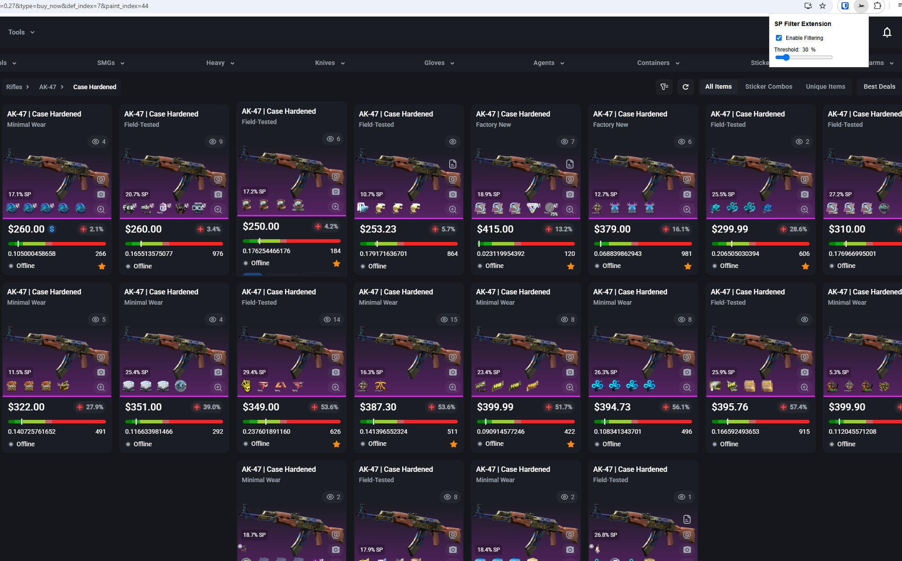

# SP Filter Extension - README

## Example  
Below is an example of how the extension looks when opened:  

  

## Overview  
The **SP Filter Extension** allows users to automatically hide item cards based on their sticker percentage (**SP**) value. It removes any `<item-card>` elements that:

- Have a **sticker percentage (SP) greater than or equal** to the selected threshold.  
- Display **">100% SP"** in the sticker percentage field.  
- Do **not contain any "% SP"** value.  

---

## How to Use  

### Install the Extension  
1. Load it as an **unpacked extension** in Chrome:  
   - Open `chrome://extensions/`  
   - Enable **Developer Mode** (toggle in the top right corner)  
   - Click **"Load unpacked"** and select the extension folder  

---

### Activate Filtering  
1. Click the **SP Filter Extension** icon in the toolbar.  
2. Toggle **"Enable Filtering"** to **ON** to start filtering items.  

---

### Adjust the Threshold  
- Use the **slider** to set the SP threshold.  
- Items with a **sticker percentage greater than or equal** to this value will be removed.  

---

### Disable Filtering  
- Toggle **"Enable Filtering"** to **OFF** to restore all hidden items.  

---

---

## Notes  
- The filter **automatically updates** when new items load on the page.  
- **Reload** the extension after making changes in `chrome://extensions/` if needed.  

This tool ensures you only see items within your preferred sticker price range.
