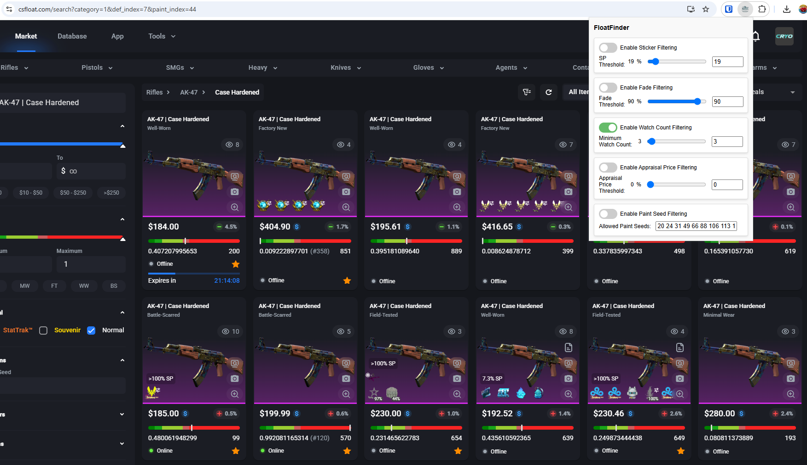

# FloatFinder




## Features

- **Sticker Filter:**  
  Hide items with a sticker percentage (SP) above a user-specified threshold. When enabled, items without an SP value are also hidden.

- **Fade Filter:**  
  Hide items with a fade value below a set threshold.

- **Watch Count Filter:**  
  Hide items with a watch count lower than a specified threshold. Items missing a watch count are hidden when this filter is enabled.

- **Appraisal Filter:**  
  Hide items with an appraisal price below a specified threshold. The slider is configured to use only positive values (0–100).

- **Paint Seed Filter:**  
  Hide items whose paint seed is not in your list of allowed seeds. You can enable the filter and paste a list of allowed seeds (space-separated) into a text box.

## Installation

1. **Clone or Download the Repository**

   ```bash
   git clone https://github.com/yourusername/sp-filter-extension.git
Load the Extension in Chrome

Open Chrome and navigate to chrome://extensions/.
Enable "Developer mode" by toggling the switch in the top right.
Click "Load unpacked" and select the directory where the extension files are located.
The extension icon should appear in your Chrome toolbar.
Usage
Open the Extension Popup

Click the extension icon in your toolbar to open the popup interface.

Configure Your Filters

Sticker Filter:
Toggle the switch to enable/disable the sticker filter. Use the slider or number input to set the SP threshold. When enabled, items with an SP equal to or above this threshold will be hidden. Items with no SP value will also be hidden.

Fade Filter:
Toggle to enable fade filtering. Adjust the slider or enter a value to set the fade threshold. Items with a fade value below the threshold will be hidden.

Watch Count Filter:
Enable this filter and set a minimum watch count. Items with a watch count below this value or with no watch count will be hidden.

Appraisal Filter:
Enable the appraisal filter and set a threshold (0–100). Items with an appraisal price below this threshold will be hidden.

Paint Seed Filter:
Toggle the paint seed filter and enter your allowed paint seeds in the provided text box (seeds should be space-separated, e.g., 127 200 300). Only items with a paint seed found in your list will be displayed; all others will be hidden.

Automatic Filtering

Changes you make in the popup are applied immediately to the items on supported pages. Make sure you are on a page that matches the URL pattern specified in manifest.json (e.g., *://csfloat.com/*).
